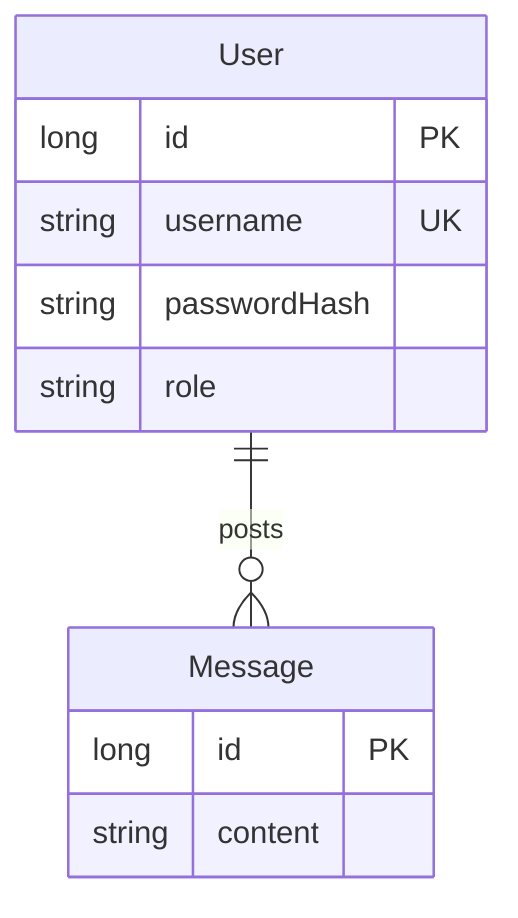

# Data model

The application's data model consists of the following entities:

- _Message_ represents a message with a textual content posted by a user. Message belongs to one user who has posted the message.
- _User_ represents a registered user associated with a username. User has many messages which they have posted.

This entity relationship diagram represents the application's entities and their relationships:

